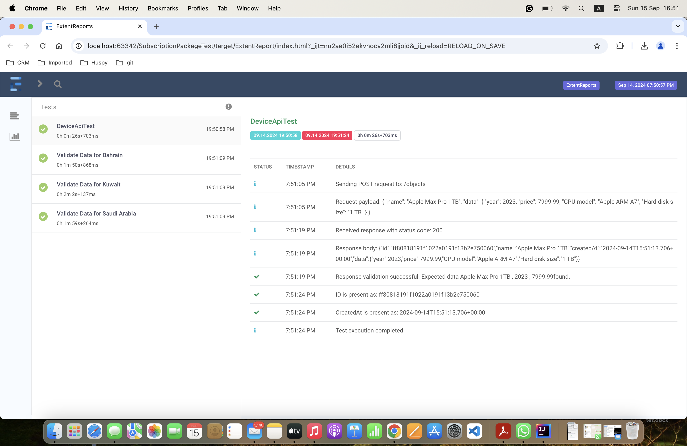
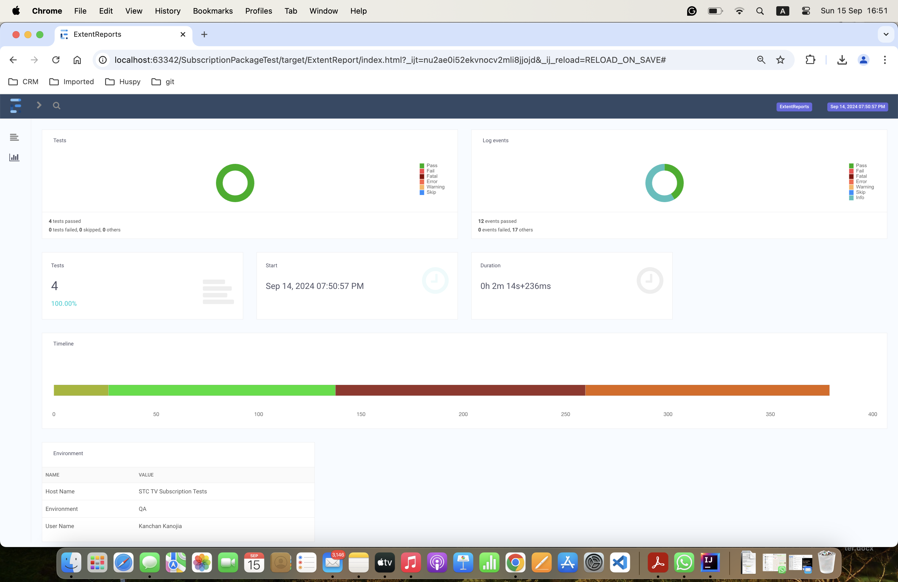

# **SubscriptionPackage Automation Framework**

## **Table of Contents**
- [Overview](#overview)
- [Prerequisites](#prerequisites)
- [Project Structure](#project-structure)
- [Installation & Setup](#installation--setup)
- [Running Tests](#running-tests)
    - [Frontend Test](#frontend-test)
    - [API Test](#api-test)
    - [Run All Tests](#run-all-tests)
- [Reporting](#reporting)
- [Key Features](#key-features)
- [Future Enhancements](#future-enhancements)
- [Troubleshooting](#troubleshooting)
- [Contact Information](#contact-information)

---

## **Overview**

The **SubscriptionPackageTest** Automation Framework is a comprehensive, modular testing suite designed to automate both **frontend** and **API** testing. Developed in **Java** with **TestNG**, this framework leverages **Selenium WebDriver** for frontend validation and **Rest Assured** for API automation.

The primary objectives of this project are:
1. **Frontend Testing**: Validate subscription packages (Type, Price, and Currency) for three regions — Saudi Arabia, Kuwait, and Bahrain — on the [STC TV Subscription Page](https://subscribe.stctv.com/sa-en).
2. **API Testing**: Automate adding a new device via a REST API and validate the correctness of the response.

This framework is engineered to follow best practices in automation, ensuring scalability, maintainability, and reliability while offering powerful reporting capabilities through **Extent Reports**.

---

## **Prerequisites**

Before running the tests, ensure the following software is installed:

- **Java Development Kit (JDK)** 1.8 or above
- **Maven** (version 3.x or later)
- **Chrome** browser (latest version)
- **TestNG** (Test orchestration)
- **Rest Assured** (API testing)
- **Selenium WebDriver** (Web interaction for frontend testing)
- **ChromeDriver** (Automated browser interactions via WebDriverManager)

The framework automatically manages the WebDriver versions via WebDriverManager, so no manual configuration is required for browser drivers.

---

## **Project Structure**

The project is organized using the standard **Maven** structure, ensuring ease of navigation and modularity. Below is the directory structure:

```
SubscriptionPackageTest/
│
├── src/
│   ├── main/
│   │   └── java/
│   │       └── utils/       # Utility classes (e.g., reporting, configuration)
│   └── test/
│       ├── java/
│       │   ├── frontend/    # Frontend test cases
│       │   ├── api/         # API test cases
│       │   └── utils/       # Helper classes and utilities for testing
│       └── resources/
│           └── testng.xml   # TestNG suite configuration
│
├── pom.xml                  # Maven dependencies and configurations
├── README.md                # Project documentation
└── target/                  # Output folder for reports and results
```

This structure promotes a clean separation of concerns, making it easier to maintain and extend the codebase.

---

## **Installation & Setup**

Follow these steps to clone the project and set it up locally:

1. **Clone the Repository**:
   ```bash
   git clone <repository-url>
   cd SubscriptionPackageTest
   ```

2. **Install Dependencies**:
   Use Maven to install all required dependencies:
   ```bash
   mvn clean install
   ```

3. **Browser Configuration**:
   The project uses **WebDriverManager** to automatically manage the correct versions of ChromeDriver. Ensure your **Chrome browser** is updated to the latest version.

---

## **Running Tests**

### **Frontend Test**

The frontend test navigates to the [STC TV Subscription Page](https://subscribe.stctv.com/sa-en) and validates subscription package details, including Type, Price, and Currency for the following countries:
- **Saudi Arabia (SA)**
- **Kuwait (KW)**
- **Bahrain (BH)**

To execute the frontend tests:
```bash
mvn test -Dtest=SubscriptionPackageTest
```

### **API Test**

The API test adds a new device using the provided API endpoint and validates the response data, including the `id`, `name`, `createdAt`, and device specifications.

- **API Endpoint**: `https://api.restful-api.dev/objects`

To run the API tests:
```bash
mvn test -Dtest=AddDeviceApiTest
```

### **Run All Tests**

To execute both frontend and API tests as a suite:
```bash
mvn test
```

---

## **Reporting**

**Extent Reports** are integrated into the framework to generate detailed, interactive test execution reports.

1. **Report Generation**: After running the tests, the reports are automatically generated in the following location:
   ```
   target/ExtentReport/index.html
   ```

2. **Viewing Reports**: Open the `index.html` file in a web browser to view a rich, interactive report, including details on pass/fail status, execution time, and errors (if any).

The reporting system is thread-safe and ensures that logs and results are accurately captured for parallel test execution.




---

## **Key Features**

- **Robust & Modular Framework**: Clean separation of frontend and API tests ensures ease of maintenance and scalability.
- **Selenium WebDriver & TestNG**: Used for robust and scalable frontend automation.
- **Rest Assured Integration**: Facilitates easy API testing with comprehensive validation capabilities.
- **Thread-Safe Reporting**: Extent Reports ensures that test execution results are recorded in a thread-safe manner, making it suitable for parallel test runs.
- **Explicit Waits for Frontend Tests**: Improved reliability by using explicit waits to handle dynamic content on the frontend.
- **Coding Best Practices**: Follows industry standards for readability, maintainability, and performance optimization.

---

## **Future Enhancements**

- **Parameterization**: Introduce parameterized test execution to run tests across different environments (QA, Staging, Production).
- **Dockerization**: Add Docker support for running tests in containerized environments, ensuring consistency across different machines and environments.
- **Test Data Externalization**: Move test data (such as subscription package details) to external files (JSON, CSV) to improve flexibility and ease of updates without modifying the test code.

---

## **Troubleshooting**

- **Dependency Resolution**: Ensure Maven is properly resolving dependencies by running:
   ```bash
   mvn clean install
   ```

- **ChromeDriver Issues**: Ensure that your **Chrome browser** version is compatible with the **ChromeDriver** version. WebDriverManager should automatically handle this, but manual updates may be required in rare cases.

- **Slow Test Execution**: If tests are taking longer than expected, check for network issues or adjust explicit wait times for faster performance.

---

## **Contact Information**

For any questions, issues, or further assistance with this project, please feel free to reach out to:

**Kanchan Kanojia**  
Project Owner, **SubscriptionPackageTest Automation Framework**  
Email: kanchankkanojia@gmail.com
GitHub: https://github.com/KanchanKKanojia
